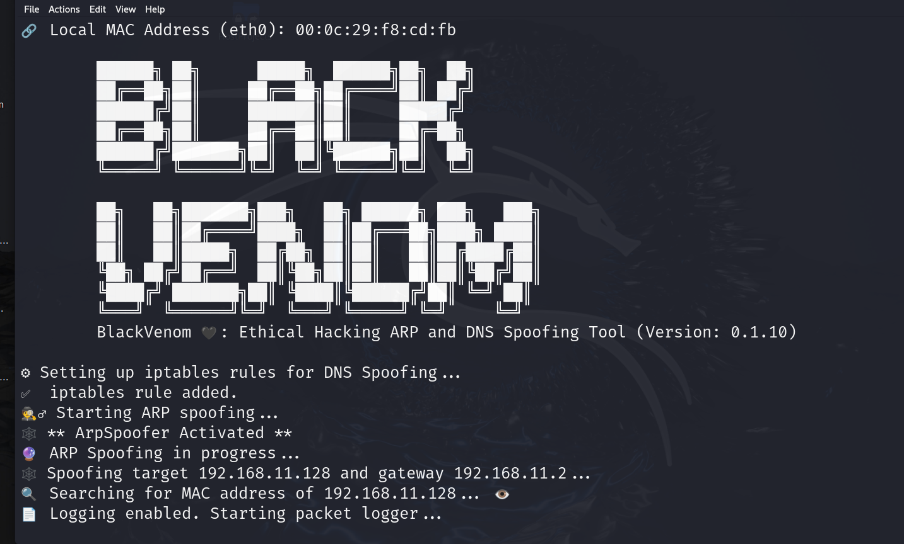
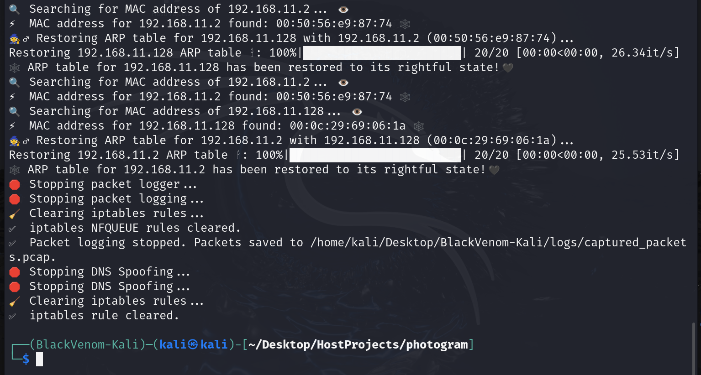
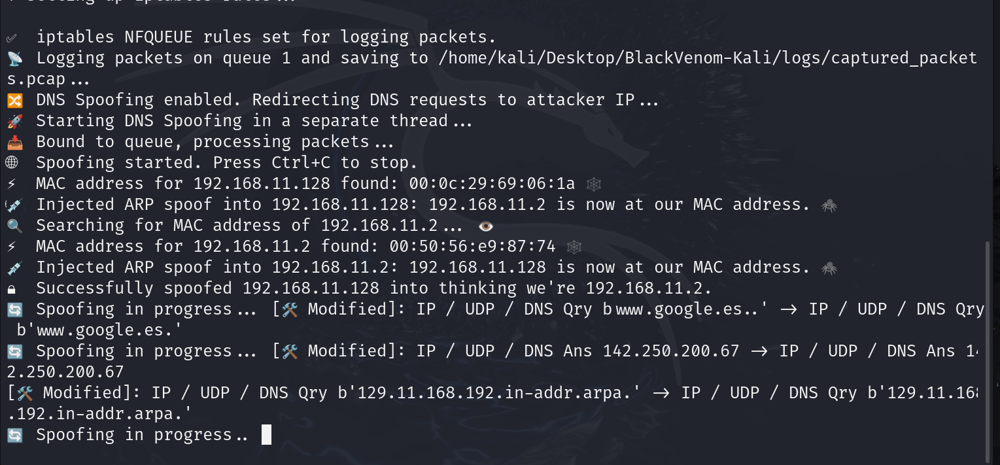

# 🕷️ **BlackVenom**: The Ethical ARP and DNS Spoofing Tool for Cybersecurity 🕸️

**BlackVenom** is a personal project developed as part of my learning journey during a **Cybersecurity course**. 🧑‍💻 The tool is designed for ethical hackers and cybersecurity professionals to practice and enhance their skills in **ARP and DNS spoofing**, a key technique used to **intercept network traffic** and identify **network vulnerabilities**. 🛡️

Created as a hands-on project to explore real-world **network manipulation** techniques in a controlled environment, **BlackVenom** allows users to practice **penetration testing** and **vulnerability analysis**. Through this project, I learned how to detect misconfigurations and weaknesses in networks by manipulating **ARP tables** and spoofing **DNS requests**, all while remaining undetected. 🕵️‍♂️⚡

Built with stealth and precision in mind, **BlackVenom** enables a deep dive into network traffic analysis for educational purposes. This project is designed to empower both beginners and professionals to better understand how to identify vulnerabilities and secure networks against potential exploits. 🖤

🙏 A special thanks to [Santiago Hernández, a leading expert in Cybersecurity and Artificial Intelligence](https://www.udemy.com/user/shramos/), whose **Cybersecurity and Ethical Hacking** course on Udemy guided me through many aspects of network security. The knowledge and techniques gained from this course were pivotal in the development of this project.

Join me in exploring **BlackVenom**, a tool built for educational purposes to help enhance cybersecurity skills and better understand how vulnerabilities can be uncovered through ethical hacking practices! 🕸️✨

<p align="center">
  
  
</p>

<p align="center">
  
</p>

## ⚠️ Disclaimer  

**BlackVenom** was developed **exclusively for educational and research purposes** as part of my **learning experience in cybersecurity and ethical hacking**. This project serves as a **practical application of the knowledge acquired during a cybersecurity course**, allowing me to experiment in a **controlled lab environment** and include it in my **cybersecurity portfolio**.  

This tool is intended **only for ethical and authorized security testing**. Any use **outside of legal and authorized environments**—such as penetration testing labs, cybersecurity research, or approved security assessments—is strictly **prohibited**.  

**Unauthorized use of BlackVenom on external systems is illegal** and may violate laws.  

**I assume no responsibility for misuse of this tool.** Always operate within **legal and ethical boundaries** and **obtain explicit permission before conducting any network security tests**.

### Key Features of These Tools:
- **🌐 ARP Spoofing Mastery**: Learn how to conduct **bidirectional ARP spoofing** to impersonate devices and intercept traffic between them. This is an important technique in **network penetration testing** and an essential skill for ethical hackers.

- **🔍 DNS Spoofing Capabilities**: Gain practical experience with **DNS spoofing**, where you can manipulate DNS requests to redirect users to malicious sites. This technique helps you understand how attackers can hijack DNS resolutions and perform **phishing** or **man-in-the-middle** attacks.

- **📄 Traffic Logging**: Capture and log all intercepted network traffic using **PCAP files**. Traffic logging is a key skill in network forensics and security audits, allowing you to analyze intercepted data to uncover vulnerabilities and misconfigurations.

- **⚙️ Ethical & Stealthy**: All tools are built with an **ethical hacking** mindset, ensuring you can conduct your assessments and tests without leaving traces. This helps you understand how to remain **undetected** while discovering security weaknesses.


<p align="center">
  
</p>

### Use Cases:
- **Network Penetration Testing**: Perform thorough assessments of network security by identifying vulnerabilities in **ARP protocols** and **DNS resolutions**. Practice simulating real-world attacks on a network to understand potential weaknesses.

- **Security Auditing**: Utilize these tools to log and analyze network traffic, uncovering potential vulnerabilities and weaknesses. This hands-on approach will help you improve your **security auditing skills**.

- **Educational Purposes**: These tools are perfect for learning and teaching key **network security concepts**. By experimenting with **ARP** and **DNS spoofing**, you’ll gain a deeper understanding of how these techniques are used in **real-world attacks** and defenses.

- **Traffic Analysis**: Monitor and capture network traffic for **forensic investigations** or behavioral analysis. This helps you understand the significance of **traffic patterns** in identifying security flaws and improving network defenses.

<p align="center">
  
</p>

### Understanding ARP Spoofing and DNS Spoofing 🔍

- **ARP Spoofing**: This technique involves sending false ARP (Address Resolution Protocol) messages over a local area network. By doing so, an attacker can associate their MAC address with the IP address of another device (e.g., the default gateway), allowing them to intercept and manipulate traffic intended for that device. This can lead to various attacks, including man-in-the-middle attacks and session hijacking. ⚠️

- **DNS Spoofing**: This technique manipulates DNS (Domain Name System) responses to redirect traffic from legitimate websites to malicious ones. By altering the DNS records, an attacker can control what IP addresses users are directed to when they attempt to access specific domains. This can be used to carry out phishing attacks or serve malicious content. 🌐

<p align="center">
  
</p>

### IP Forwarding and IPTABLES 📡

For **BlackVenom** to successfully intercept and forward traffic between the target and gateway, IP forwarding must be enabled on the system. This allows the machine running BlackVenom to act as a bridge, forwarding packets between the target and the network. 

To enable IP forwarding, use the following command:

```bash
echo 1 > /proc/sys/net/ipv4/ip_forward

Additionally, you may need to configure IPTABLES to allow forwarding of packets. Here’s a basic command to set up the necessary rules:

iptables -A FORWARD -i eth0 -j ACCEPT
iptables -A FORWARD -o eth0 -m state --state RELATED,ESTABLISHED -j ACCEPT
```

These commands ensure that the traffic can flow through the machine while BlackVenom performs its operations. 🛡️

### Key Techniques in BlackVenom Development 🛠️

- **NetFilterQueue**: This library allows the interception of packets within the Linux kernel's Netfilter framework. It provides a powerful way to capture and manipulate network packets, making it an essential tool for implementing ARP and DNS spoofing techniques. 🥅

- **Scapy**: A powerful Python library used for packet manipulation, Scapy allows for the creation, sending, and receiving of network packets. It's crucial for constructing ARP and DNS packets needed for spoofing. 📦

- **Threading**: To ensure that the tool operates efficiently without blocking the main execution thread, threading is utilized to manage concurrent packet processing for both ARP and DNS spoofing operations. 🧵

- **Traffic Logging**: Using libraries like `pcap` and `tqdm`, BlackVenom captures and logs network traffic in real-time, providing a comprehensive analysis of intercepted packets for further examination. 📊


### Dependencies 📦

**BlackVenom** requires several Python packages to function effectively. Below are the key dependencies along with their respective versions:

- **scapy==2.6.0** 🐍: A powerful Python library for network packet manipulation, allowing the creation, sending, and sniffing of network packets.
- **tqdm==4.65.0** ⏳: A fast, extensible progress bar for Python, used to provide visual feedback during long-running tasks.
- **rich==13.9.2** 🌈: A library for rich text and beautiful formatting in the terminal, enhancing the output of the tool with colors and styles.
- **netifaces==0.11.0** 🌐: A cross-platform library to get network interface information, useful for identifying available interfaces for ARP spoofing.
- **NetfilterQueue==1.1.0** 🔄: A Python binding to the netfilter queue library, allowing the manipulation of packets in user space for packet filtering and modification.

Ensure that these dependencies are installed in your Python environment to use **BlackVenom** effectively. ✅

### Installation 🛠️

To install and run **BlackVenom**, follow these simple steps:

#### 1. Create a Python Virtual Environment 🐍
First, create a virtual environment to manage dependencies:

```bash
python -m venv BlackVenom-Kali
```

#### 2. Activate the Virtual Environment 🔑
Activate the virtual environment:

```bash
source BlackVenom-Kali/bin/activate
```

#### 3. Install Dependencies 📦
Now, install the necessary dependencies from the requirements.txt file:

```bash
pip install -r requirements.txt
```

4. Run the Tool ⚡
After installation, you can run BlackVenom using the provided CLI:

```bash
python black_venom_cli.py
```

### Usage Examples

#### Example 1: Basic ARP Spoofing
This command performs a basic ARP spoofing attack between a target and a gateway without enabling packet logging or DNS spoofing. 🔗

```bash
sudo python black_venom_cli.py \
    --target_ip 192.168.11.128 \
    --gateway_ip 192.168.11.2 \
    --interface eth0
```

#### Example 2: ARP Spoofing with Traffic Logging
In this example, packet logging is enabled while performing ARP spoofing. 📝

```bash
sudo python black_venom_cli.py \
    --target_ip 192.168.11.128 \
    --gateway_ip 192.168.11.2 \
    --interface eth0 \
    --enable_logging \
    --log_file ~/Desktop/captured_packets.pcap

```


#### Example 3: ARP Spoofing and DNS Spoofing
This command enables both ARP spoofing and DNS spoofing, redirecting DNS requests for a specific domain. 🌐🔀

```bash
sudo python black_venom_cli.py \
    --target_ip 192.168.11.128 \
    --gateway_ip 192.168.11.2 \
    --interface eth0 \
    --enable_logging \
    --log_file ~/Desktop/captured_packets.pcap
```

#### Example 4: Multiple DNS Records
Here multiple DNS records are redirected to a specific IP. This command performs ARP and DNS spoofing while logging traffic. 📄🔄

```bash
sudo python black_venom_cli.py \
    --target_ip 192.168.11.128 \
    --gateway_ip 192.168.11.2 \
    --interface eth0 \
    --enable_logging \
    --log_file ~/Desktop/captured_packets.pcap \
    --spoof_dns \
    --dns_records "example.com=192.168.11.10" "anotherdomain.com=192.168.11.11"
```

#### Example 5: No Logging but with DNS Spoofing
This example performs ARP spoofing and DNS spoofing without enabling traffic logging. 🚫📝

```bash
sudo python black_venom_cli.py \
    --target_ip 192.168.11.128 \
    --gateway_ip 192.168.11.2 \
    --interface eth0 \
    --spoof_dns \
    --dns_records "example.com=192.168.11.10"
```

### Summary of Options
- **`--target_ip`**: IP address of the target device. 💻
- **`--gateway_ip`**: IP address of the network gateway. 🌉
- **`--interface`**: Network interface to use (default is `eth0`). 🌐
- **`--enable_logging`**: Enable traffic logging to a PCAP file. 📝
- **`--log_file`**: Path and name of the PCAP file for logging. 📂
- **`--spoof_dns`**: Enable DNS spoofing. 🌐
- **`--attacker_ip`**: IP to which DNS requests should be redirected. 🚀
- **`--dns_queue_num`**: Queue number for DNS spoofing (default is `2`). 📊
- **`--dns_records`**: DNS records in the format `'domain=ip'` to redirect requests. 📜

## ⚠️ Disclaimer  

**BlackVenom** was developed **exclusively for educational and research purposes** as part of my **learning experience in cybersecurity and ethical hacking**. This project serves as a **practical application of the knowledge acquired during a cybersecurity course**, allowing me to experiment in a **controlled lab environment** and include it in my **cybersecurity portfolio**.  

This tool is intended **only for ethical and authorized security testing**. Any use **outside of legal and authorized environments**—such as penetration testing labs, cybersecurity research, or approved security assessments—is strictly **prohibited**.  

**Unauthorized use of BlackVenom on external systems is illegal** and may violate laws.  

**I assume no responsibility for misuse of this tool.** Always operate within **legal and ethical boundaries** and **obtain explicit permission before conducting any network security tests**.


## Acknowledgements 🙏

🙏 I would like to express my sincere gratitude to [Santiago Hernández, a leading expert in Cybersecurity and Artificial Intelligence](https://www.udemy.com/user/shramos/). His outstanding course on **Cybersecurity and Ethical Hacking**, available on Udemy, was instrumental in the development of this project. The insights and techniques I gained from his course were invaluable in guiding my approach to cybersecurity practices. Thank you for sharing your knowledge and expertise!

## 🤝 **Contributing**
Contributions to BlackVenom are highly encouraged! If you're interested in adding new features, resolving bugs, or enhancing the project's functionality, please feel free to submit pull requests.

## Get in Touch 📬

BlackVenom is developed and maintained by **Sergio Sánchez Sánchez** (Dream Software). Special thanks to the open-source community and the contributors who have made this project possible. If you have any questions, feedback, or suggestions, feel free to reach out at  [dreamsoftware92@gmail.com](mailto:dreamsoftware92@gmail.com).

## Visitors Count


 
 ## Please Share & Star the repository to keep me motivated.
  <a href = "https://github.com/sergio11/blackvenom/stargazers">
     
  </a>

## License ⚖️

This project is licensed under the MIT License, an open-source software license that allows developers to freely use, copy, modify, and distribute the software. 🛠️ This includes use in both personal and commercial projects, with the only requirement being that the original copyright notice is retained. 📄

Please note the following limitations:

- The software is provided "as is", without any warranties, express or implied. 🚫🛡️
- If you distribute the software, whether in original or modified form, you must include the original copyright notice and license. 📑
- The license allows for commercial use, but you cannot claim ownership over the software itself. 🏷️

The goal of this license is to maximize freedom for developers while maintaining recognition for the original creators.

```
MIT License

Copyright (c) 2024 Dream software - Sergio Sánchez 

Permission is hereby granted, free of charge, to any person obtaining a copy
of this software and associated documentation files (the "Software"), to deal
in the Software without restriction, including without limitation the rights
to use, copy, modify, merge, publish, distribute, sublicense, and/or sell
copies of the Software, and to permit persons to whom the Software is
furnished to do so, subject to the following conditions:

The above copyright notice and this permission notice shall be included in all
copies or substantial portions of the Software.

THE SOFTWARE IS PROVIDED "AS IS", WITHOUT WARRANTY OF ANY KIND, EXPRESS OR
IMPLIED, INCLUDING BUT NOT LIMITED TO THE WARRANTIES OF MERCHANTABILITY,
FITNESS FOR A PARTICULAR PURPOSE AND NONINFRINGEMENT. IN NO EVENT SHALL THE
AUTHORS OR COPYRIGHT HOLDERS BE LIABLE FOR ANY CLAIM, DAMAGES OR OTHER
LIABILITY, WHETHER IN AN ACTION OF CONTRACT, TORT OR OTHERWISE, ARISING FROM,
OUT OF OR IN CONNECTION WITH THE SOFTWARE OR THE USE OR OTHER DEALINGS IN THE
SOFTWARE.
```
