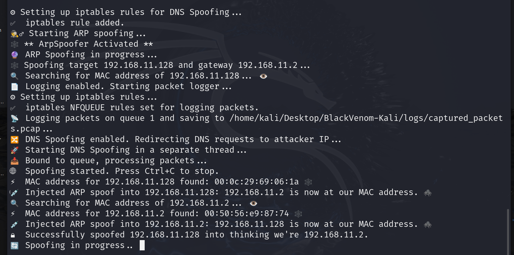

# 🕷️ BlackVenom: The Ultimate Ethical ARP and DNS Spoofing Tool 🕸️

**BlackVenom** is a powerful ARP and DNS spoofing tool designed for ethical hackers and cybersecurity professionals. 🛡️ This utility allows you to seamlessly intercept and log network traffic, providing valuable insights into network vulnerabilities while remaining undetected. 🕵️‍♂️⚡

Built with stealth and precision in mind, **BlackVenom** operates like a digital venomous strike: fast, effective, and silent. 🖤 Whether you're conducting penetration tests, monitoring network vulnerabilities, or analyzing traffic for security research, **BlackVenom** empowers you to take full control of ARP tables and spoof DNS requests for educational and professional purposes. 🖥️💉

🙏 I would like to express my sincere gratitude to [Santiago Hernández, a leading expert in Cybersecurity and Artificial Intelligence](https://www.udemy.com/user/shramos/). His outstanding course on **Cybersecurity and Ethical Hacking**, available on Udemy, was instrumental in the development of this project. The insights and techniques I gained from his course were invaluable in guiding my approach to cybersecurity practices. Thank you for sharing your knowledge and expertise!

Join the BlackVenom web of digital defenders and harness the power of stealthy network manipulation for the greater good! 🕸️✨

### Disclaimer ⚠️
BlackVenom is intended for ethical use only. Misuse of this tool against unauthorized systems is illegal and may result in severe penalties. Always obtain permission before testing network security. 📜

<p align="center">
  
  
</p>

<p align="center">
  
</p>

## 🌟 **Explore My Other Open-Source Ethical Hacking Tools**

If you're interested in more powerful tools for ethical hacking, make sure to check out my other open-source projects designed to help cybersecurity professionals and penetration testers:

- [🦅 **NetHawk**](https://github.com/sergio11/nethawk_analyzer): A state-of-the-art **AI-powered ethical hacking tool** for **network vulnerability assessment**. Using advanced frameworks like **Scapy** and **Nmap**, NetHawk automates **port scanning**, **vulnerability detection**, and **report generation**, making security audits faster, smarter, and more efficient. Whether you're a **network administrator**, **cybersecurity expert**, or **ethical hacker**, NetHawk simplifies the assessment process and offers actionable insights to fortify your systems.  

- [💀 **Nemesys**](https://github.com/sergio11/nemesys): An advanced **exploitation** and **post-exploitation** tool built on top of the **Metasploit Framework** for automating critical data harvesting and system enumeration.  
- [🌐 **ZeroTrace**](https://github.com/sergio11/zero_trace_hacking_tool): A powerful **search engine dorking** tool designed to identify **attack vectors** and uncover **exposed sensitive information** across the web.
- [🔐 **DecryptX**](https://github.com/sergio11/decryptx): An **advanced hash and password security assessment tool** that helps **cybersecurity experts** and **penetration testers** analyze **password hashes** and **encrypted ZIP files** to assess the robustness of security implementations.
-  [ 🌑 **EclipseRecon**](https://github.com/sergio11/eclipserecon): is a stealthy web reconnaissance tool for uncovering hidden vulnerabilities, subdomains, and site structures. 🕵️‍♂️🔍 It empowers security professionals to identify critical attack surfaces with precision, ensuring proactive defense. 🚨💻
-  [ 🌐 **ZoneGuardian**](https://github.com/sergio11/zoneguardian): A powerful tool to analyze DNS configurations, detect vulnerabilities, and generate actionable security reports. 🔒🚀 Safeguard your digital assets with precision and ease!
- [🔍 **Retrospect**](https://github.com/sergio11/retrospect): A cutting-edge **reconnaissance and security analysis tool** that retrieves and analyzes historical web snapshots, helping you uncover past vulnerabilities and misconfigurations before they can be exploited today. Ideal for **ethical hackers** and **digital forensics experts**.

These tools are designed to streamline penetration testing, enhance security assessments, and provide in-depth insights into vulnerabilities. Explore them to level up your ethical hacking skills! 💻🔍


### Key Features:
- **🌐 ARP Spoofing Mastery**: Perform bidirectional ARP spoofing to impersonate devices and intercept traffic between them. 🔄
- **🔍 DNS Spoofing Capabilities**: Redirect DNS requests to specified IP addresses, enabling control over domain resolutions. 📡
- **📄 Traffic Logging**: Capture and log all intercepted network traffic in a configurable PCAP file for later analysis. 📂
- **⚙️ Ethical & Stealthy**: Designed for ethical hacking, ensuring you stay invisible while uncovering security flaws. 🕶️

<p align="center">
  
</p>

### Use Cases:
- **Network Penetration Testing**: Assess the security of networks by identifying weaknesses in ARP protocols and DNS resolutions. 🔍🛡️
- **Security Auditing**: Log and analyze network traffic to discover potential vulnerabilities and improve network defenses. 📊🔒
- **Educational Purposes**: Learn and teach network security concepts through practical, hands-on experience with ARP and DNS spoofing techniques. 🎓📚
- **Traffic Analysis**: Monitor and capture traffic for forensic investigations or to understand user behavior on a network. 🔍📈

<p align="center">
  
</p>

### Understanding ARP Spoofing and DNS Spoofing 🔍

- **ARP Spoofing**: This technique involves sending false ARP (Address Resolution Protocol) messages over a local area network. By doing so, an attacker can associate their MAC address with the IP address of another device (e.g., the default gateway), allowing them to intercept and manipulate traffic intended for that device. This can lead to various attacks, including man-in-the-middle attacks and session hijacking. ⚠️

- **DNS Spoofing**: This technique manipulates DNS (Domain Name System) responses to redirect traffic from legitimate websites to malicious ones. By altering the DNS records, an attacker can control what IP addresses users are directed to when they attempt to access specific domains. This can be used to carry out phishing attacks or serve malicious content. 🌐

<p align="center">
  
</p>

### IP Forwarding and IPTABLES 📡

For **BlackVenom** to successfully intercept and forward traffic between the target and gateway, IP forwarding must be enabled on the system. This allows the machine running BlackVenom to act as a bridge, forwarding packets between the target and the network. 

To enable IP forwarding, use the following command:

```bash
echo 1 > /proc/sys/net/ipv4/ip_forward

Additionally, you may need to configure IPTABLES to allow forwarding of packets. Here’s a basic command to set up the necessary rules:

iptables -A FORWARD -i eth0 -j ACCEPT
iptables -A FORWARD -o eth0 -m state --state RELATED,ESTABLISHED -j ACCEPT
```

These commands ensure that the traffic can flow through the machine while BlackVenom performs its operations. 🛡️

### Key Techniques in BlackVenom Development 🛠️

- **NetFilterQueue**: This library allows the interception of packets within the Linux kernel's Netfilter framework. It provides a powerful way to capture and manipulate network packets, making it an essential tool for implementing ARP and DNS spoofing techniques. 🥅

- **Scapy**: A powerful Python library used for packet manipulation, Scapy allows for the creation, sending, and receiving of network packets. It's crucial for constructing ARP and DNS packets needed for spoofing. 📦

- **Threading**: To ensure that the tool operates efficiently without blocking the main execution thread, threading is utilized to manage concurrent packet processing for both ARP and DNS spoofing operations. 🧵

- **Traffic Logging**: Using libraries like `pcap` and `tqdm`, BlackVenom captures and logs network traffic in real-time, providing a comprehensive analysis of intercepted packets for further examination. 📊


### Dependencies 📦

**BlackVenom** requires several Python packages to function effectively. Below are the key dependencies along with their respective versions:

- **scapy==2.6.0** 🐍: A powerful Python library for network packet manipulation, allowing the creation, sending, and sniffing of network packets.
- **tqdm==4.65.0** ⏳: A fast, extensible progress bar for Python, used to provide visual feedback during long-running tasks.
- **rich==13.9.2** 🌈: A library for rich text and beautiful formatting in the terminal, enhancing the output of the tool with colors and styles.
- **netifaces==0.11.0** 🌐: A cross-platform library to get network interface information, useful for identifying available interfaces for ARP spoofing.
- **NetfilterQueue==1.1.0** 🔄: A Python binding to the netfilter queue library, allowing the manipulation of packets in user space for packet filtering and modification.

Ensure that these dependencies are installed in your Python environment to use **BlackVenom** effectively. ✅

### Installation 🛠️

To install and run **BlackVenom**, follow these simple steps:

#### 1. Create a Python Virtual Environment 🐍
First, create a virtual environment to manage dependencies:

```bash
python -m venv BlackVenom-Kali
```

#### 2. Activate the Virtual Environment 🔑
Activate the virtual environment:

```bash
source BlackVenom-Kali/bin/activate
```

#### 3. Install Dependencies 📦
Now, install the necessary dependencies from the requirements.txt file:

```bash
pip install -r requirements.txt
```

4. Run the Tool ⚡
After installation, you can run BlackVenom using the provided CLI:

```bash
python black_venom_cli.py
```

### Usage Examples

#### Example 1: Basic ARP Spoofing
This command performs a basic ARP spoofing attack between a target and a gateway without enabling packet logging or DNS spoofing. 🔗

```bash
sudo python black_venom_cli.py \
    --target_ip 192.168.11.128 \
    --gateway_ip 192.168.11.2 \
    --interface eth0
```

#### Example 2: ARP Spoofing with Traffic Logging
In this example, packet logging is enabled while performing ARP spoofing. 📝

```bash
sudo python black_venom_cli.py \
    --target_ip 192.168.11.128 \
    --gateway_ip 192.168.11.2 \
    --interface eth0 \
    --enable_logging \
    --log_file ~/Desktop/captured_packets.pcap

```


#### Example 3: ARP Spoofing and DNS Spoofing
This command enables both ARP spoofing and DNS spoofing, redirecting DNS requests for a specific domain. 🌐🔀

```bash
sudo python black_venom_cli.py \
    --target_ip 192.168.11.128 \
    --gateway_ip 192.168.11.2 \
    --interface eth0 \
    --enable_logging \
    --log_file ~/Desktop/captured_packets.pcap
```

#### Example 4: Multiple DNS Records
Here multiple DNS records are redirected to a specific IP. This command performs ARP and DNS spoofing while logging traffic. 📄🔄

```bash
sudo python black_venom_cli.py \
    --target_ip 192.168.11.128 \
    --gateway_ip 192.168.11.2 \
    --interface eth0 \
    --enable_logging \
    --log_file ~/Desktop/captured_packets.pcap \
    --spoof_dns \
    --dns_records "example.com=192.168.11.10" "anotherdomain.com=192.168.11.11"
```

#### Example 5: No Logging but with DNS Spoofing
This example performs ARP spoofing and DNS spoofing without enabling traffic logging. 🚫📝

```bash
sudo python black_venom_cli.py \
    --target_ip 192.168.11.128 \
    --gateway_ip 192.168.11.2 \
    --interface eth0 \
    --spoof_dns \
    --dns_records "example.com=192.168.11.10"
```

### Summary of Options
- **`--target_ip`**: IP address of the target device. 💻
- **`--gateway_ip`**: IP address of the network gateway. 🌉
- **`--interface`**: Network interface to use (default is `eth0`). 🌐
- **`--enable_logging`**: Enable traffic logging to a PCAP file. 📝
- **`--log_file`**: Path and name of the PCAP file for logging. 📂
- **`--spoof_dns`**: Enable DNS spoofing. 🌐
- **`--attacker_ip`**: IP to which DNS requests should be redirected. 🚀
- **`--dns_queue_num`**: Queue number for DNS spoofing (default is `2`). 📊
- **`--dns_records`**: DNS records in the format `'domain=ip'` to redirect requests. 📜


## Acknowledgements 🙏

🙏 I would like to express my sincere gratitude to [Santiago Hernández, a leading expert in Cybersecurity and Artificial Intelligence](https://www.udemy.com/user/shramos/). His outstanding course on **Cybersecurity and Ethical Hacking**, available on Udemy, was instrumental in the development of this project. The insights and techniques I gained from his course were invaluable in guiding my approach to cybersecurity practices. Thank you for sharing your knowledge and expertise!

## 🤝 **Contributing**
Contributions to BlackVenom are highly encouraged! If you're interested in adding new features, resolving bugs, or enhancing the project's functionality, please feel free to submit pull requests.

## Get in Touch 📬

BlackVenom is developed and maintained by **Sergio Sánchez Sánchez** (Dream Software). Special thanks to the open-source community and the contributors who have made this project possible. If you have any questions, feedback, or suggestions, feel free to reach out at  [dreamsoftware92@gmail.com](mailto:dreamsoftware92@gmail.com).

## Visitors Count


 
 ## Please Share & Star the repository to keep me motivated.
  <a href = "https://github.com/sergio11/blackvenom/stargazers">
     
  </a>

## License ⚖️

This project is licensed under the MIT License, an open-source software license that allows developers to freely use, copy, modify, and distribute the software. 🛠️ This includes use in both personal and commercial projects, with the only requirement being that the original copyright notice is retained. 📄

Please note the following limitations:

- The software is provided "as is", without any warranties, express or implied. 🚫🛡️
- If you distribute the software, whether in original or modified form, you must include the original copyright notice and license. 📑
- The license allows for commercial use, but you cannot claim ownership over the software itself. 🏷️

The goal of this license is to maximize freedom for developers while maintaining recognition for the original creators.

```
MIT License

Copyright (c) 2024 Dream software - Sergio Sánchez 

Permission is hereby granted, free of charge, to any person obtaining a copy
of this software and associated documentation files (the "Software"), to deal
in the Software without restriction, including without limitation the rights
to use, copy, modify, merge, publish, distribute, sublicense, and/or sell
copies of the Software, and to permit persons to whom the Software is
furnished to do so, subject to the following conditions:

The above copyright notice and this permission notice shall be included in all
copies or substantial portions of the Software.

THE SOFTWARE IS PROVIDED "AS IS", WITHOUT WARRANTY OF ANY KIND, EXPRESS OR
IMPLIED, INCLUDING BUT NOT LIMITED TO THE WARRANTIES OF MERCHANTABILITY,
FITNESS FOR A PARTICULAR PURPOSE AND NONINFRINGEMENT. IN NO EVENT SHALL THE
AUTHORS OR COPYRIGHT HOLDERS BE LIABLE FOR ANY CLAIM, DAMAGES OR OTHER
LIABILITY, WHETHER IN AN ACTION OF CONTRACT, TORT OR OTHERWISE, ARISING FROM,
OUT OF OR IN CONNECTION WITH THE SOFTWARE OR THE USE OR OTHER DEALINGS IN THE
SOFTWARE.
```
